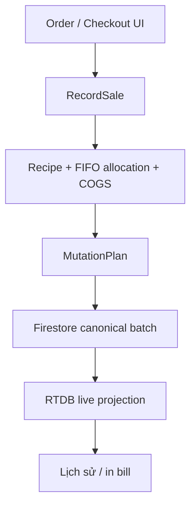
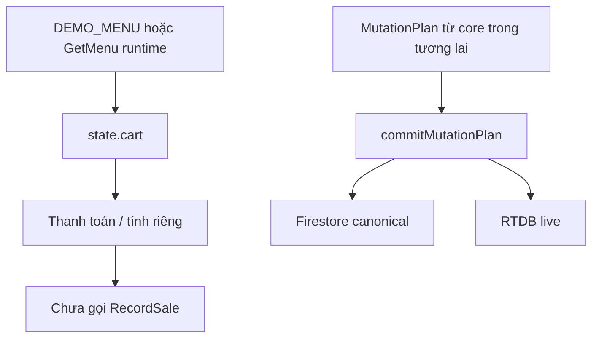
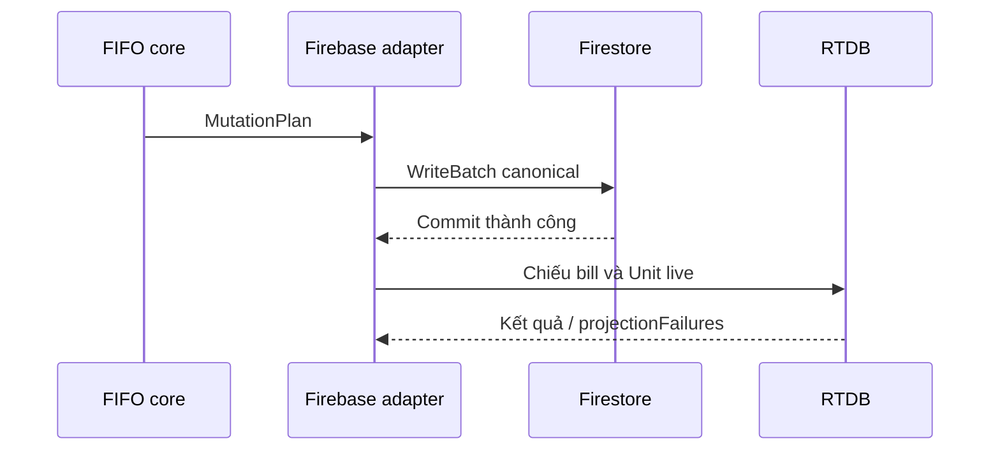
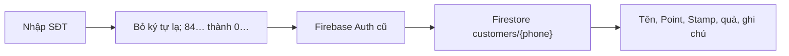
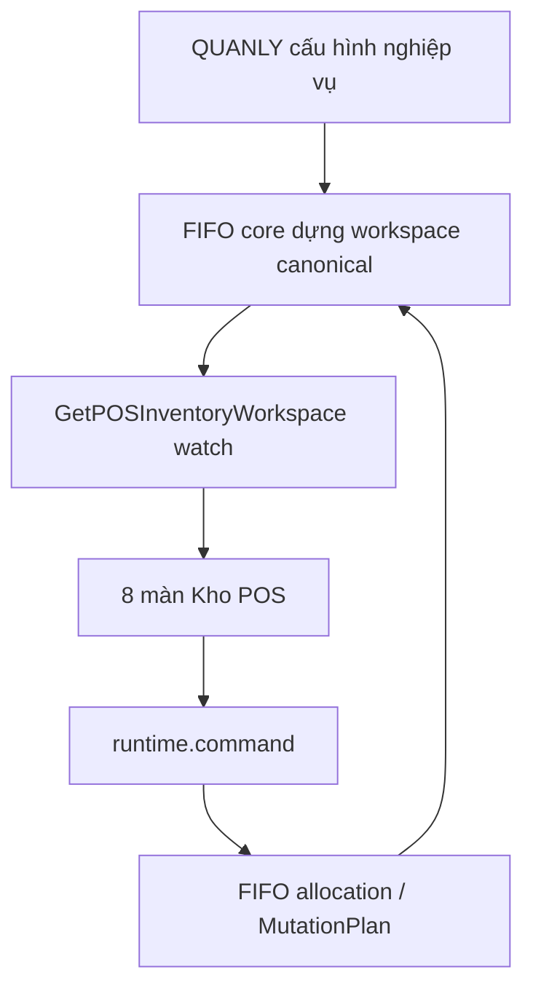
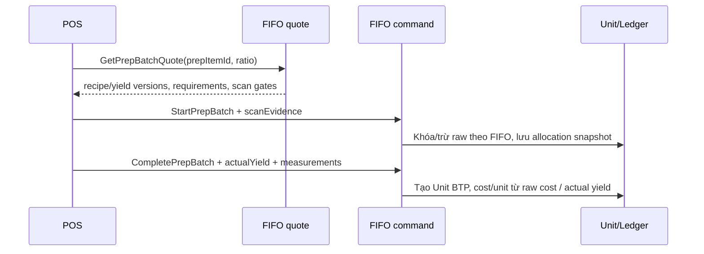

# NHẬT KÝ KỸ THUẬT — POS GIEO GIEO MỚI

> Tài liệu sống đi kèm `POS_GieoGieo_Moi.html`.
>
> Mỗi lần sửa POS, **bắt buộc cập nhật tài liệu này trong cùng lượt thay đổi**. Không được chỉ sửa HTML rồi ghi chú sau.

## 1. Thông tin bản đang theo dõi

| Mục | Giá trị |
|---|---|
| File POS | `POS_GieoGieo_Moi.html` |
| Kiểu triển khai | Một file HTML duy nhất, CSS và JavaScript viết trực tiếp trong HTML |
| Không sử dụng | Vite, React, bundler hoặc file `main.js` chạy kèm |
| Môi trường POS | Android APK bọc HTML; có thể mở trên trình duyệt để kiểm tra phần web |
| Core tham chiếu | Nhánh `codex/push-branch-using-bash-directly` |
| Firebase project | Giữ project cũ của hệ thống chuỗi |
| Context mặc định | `organizationId = org_gieo`, `storeId = store_main` |
| Ngày rà soát gần nhất | 18/09/2026 |
| Kích thước snapshot | 190.119 byte, 1.384 dòng |
| SHA-256 snapshot | `158c5331261a2a06f6f3ae7fb70284a17381c3ccf1b75cf23ee390a644630d3f` |

## 2. Mục tiêu và ranh giới đã chốt

1. Dựng POS mới dựa trên FIFO core đã hoàn thiện.
2. Giao diện và thói quen thao tác tham khảo POS Gieo Gieo cũ để nhân viên không phải học lại toàn bộ.
3. Chấp nhận bỏ schema bill, kho và dữ liệu nghiệp vụ cũ; không cần cutover dữ liệu cũ.
4. Không được mang logic tự tính FIFO từ POS cũ sang.
5. Bill mới, Unit, ledger, operation, audit và trace phải đi theo contract canonical của FIFO core.
6. Hai ngoại lệ phải giữ tương thích với hệ thống hiện hữu:
   - `bank_confirmations/{bankOrderId}` giữ nguyên vì webhook ngân hàng nằm ngoài POS.
   - Thông tin khách hàng/tích điểm tiếp tục đọc từ `customers/{phone}` trên Firestore vì dùng chung toàn chuỗi.
7. Tab Máy in phải giữ các cổng APK hiện hữu; không xây APK mới.

## 3. Cách đọc trạng thái trong tài liệu

| Trạng thái | Ý nghĩa |
|---|---|
| ✅ Hoàn thành | Đã có code, đã nối vào giao diện và đã kiểm tra ở mức phù hợp |
| 🟡 Có hạ tầng | Adapter/API đã có nhưng luồng người dùng chưa gọi tới hoàn chỉnh |
| 🎨 Chỉ giao diện | Nhìn và thao tác cục bộ được, chưa tạo nghiệp vụ thật |
| ⛔ Chưa làm | Chưa có hoặc đang dừng có chủ đích |
| ⚠ Cần kiểm thử thật | Đã kiểm tra tĩnh/giả lập nhưng chưa xác nhận trên Firebase hoặc APK production |

## 4. Tổng quan tiến độ hiện tại

| Khu vực | Trạng thái | Ghi chú ngắn |
|---|---:|---|
| Màn order | ✅ | Layout dạng grid giống thói quen POS cũ |
| Giá trên ô món | ✅ | Hiển thị ngắn `25K`, `29K`… |
| Chọn size | ✅ | Popup giữa màn hình, mở/đóng không trượt từ dưới lên |
| Giỏ hàng | ✅ | Drawer trượt mở rộng từ đáy, không phải modal đè toàn màn hình |
| Nút thông báo | ✅ | Nằm cạnh nút sidebar |
| Dữ liệu thông báo | 🎨 | Hiện là dữ liệu mẫu tĩnh, chưa lấy `GetAlerts` |
| Màn thanh toán | ✅ giao diện | Bố cục dựa trên POS cũ |
| Tiền mặt | 🎨 | Có gợi ý tiền khách đưa và tính tiền thừa; nút xác nhận chưa gọi `RecordSale` |
| Tính riêng | ✅ giao diện cục bộ | Tick chọn món, chia nhóm tiền mặt/chuyển khoản trong state của trang |
| Chuyển khoản/QR | 🟡 | Có protected Firebase path và API listener; UI QR/webhook cũ chưa graft hoàn chỉnh |
| Khách hàng/tích điểm | ✅ đọc | Đọc nguyên nguồn Firestore `customers/{phone}` dùng chung toàn chuỗi |
| Ghi/cộng loyalty | ⛔ | Chưa nối handler sau khi bill FIFO hoàn tất |
| Sidebar | ✅ | Drawer trái theo phong cách POS cũ, không che kín toàn màn hình |
| Tab Máy in | ✅ module | Có UI, Web Serial và các cổng APK Android cũ |
| Tự in sau bán | 🟡 | API in có sẵn; chưa có bill thành công để kích hoạt tự in |
| Tab Lịch sử | ✅ giao diện + đọc bill live | Đọc bill canonical ngày hiện tại; không đọc bill legacy |
| Tab Kho — landing 8 mục | ✅ UI | Giữ bố cục/thói quen của Kho POS cũ |
| Kho — listener QUANLY | 🟡 contract / ⛔ runtime hiện tại | Chỉ nghe `GetPOSInventoryWorkspace`; core nhánh hiện tại chưa đăng ký query này |
| Kho — scanner APK | ✅ adapter | Dùng lại `AndroidScanner.scan(id)` và callback `__androidScanResult`; có nhập tay |
| Kho — cân trừ bì | ✅ UI + evidence | Hỗ trợ nhiều lần cân `g/kg`; không tự đổi `ml/l` |
| Kho — hao hụt | 🟡 | Form gọi đúng `RecordWaste`; cần workspace canonical và runtime WRITE thật |
| Kho — chế biến BTP | ✅ UI / ⛔ command hai giai đoạn | Có bắt đầu/đang nấu/hoàn thành/hủy/sửa yield; core hiện chỉ có command một bước |
| Kho — nhận/kiểm/refill/mở/tem | ✅ UI / ⛔ command | Fail closed; không mượn `AdjustInventory`, không ghi Firebase trực tiếp |
| Menu thật | 🟡 | Có điểm nối `GIEO_POS_RUNTIME.watch('GetMenu')`; hiện vẫn có `DEMO_MENU` fallback |
| `RecordSale` thật | ⛔ | Core đã có ở nhánh tham chiếu nhưng chưa được nối vào nút thanh toán của HTML này |
| Firebase canonical writer | 🟡 | Đã có `commitMutationPlan`; chưa được gọi từ thanh toán thật |
| Kiểm thử Firebase thật | ⚠ | Chưa tạo bill thử trên production để tránh dữ liệu rác |
| Kiểm thử APK/máy in thật | ⚠ | Cần chạy trên APK và thiết bị thật |

## 5. Kiến trúc dữ liệu hiện tại

### 5.1 Luồng bán hàng đúng theo thiết kế FIFO — đích cần đạt



Nguyên tắc:

- UI chỉ giữ trạng thái lựa chọn món và con số tạm tính.
- `RecordSale` mới là nơi chốt bill, kiểm tra actor, ngày nghiệp vụ, recipe version, FIFO và COGS.
- Giỏ hàng chỉ được xóa sau khi `RecordSale` thành công.
- In bill hoặc in lại không được gọi lại `RecordSale`.

### 5.2 Luồng đang chạy trong HTML hiện tại



Khoảng trống hiện tại chính là `CHECKOUT → RecordSale → MutationPlan`. Adapter phía sau MutationPlan đã có, nhưng UI chưa tạo giao dịch thật.

## 6. Firebase: phần giữ lại và phần đã thay đổi

### 6.1 SDK và kết nối

HTML đang nạp Firebase compat SDK `10.13.2`:

- Firebase App
- Realtime Database
- Firestore
- Firebase Auth

Config và tài khoản xác thực lấy theo POS cũ. Tài liệu này cố ý không ghi lại API key hoặc mật khẩu.

Firebase được khởi tạo bằng named app `gieo-fifo-core`. Các listener cần quyền đọc chỉ được gắn sau khi Auth trả về người dùng hợp lệ.

### 6.2 Namespace FIFO canonical

Base path:

```text
orgs/{organizationId}/stores/{storeId}
```

Với context hiện tại:

```text
orgs/org_gieo/stores/store_main
```

| Dữ liệu | Nơi lưu | Path hiện tại |
|---|---|---|
| Unit — nguồn vật lý | Firestore | `orgs/org_gieo/stores/store_main/units/{unitId}` |
| Unit đang mở — live projection | RTDB | `orgs/org_gieo/stores/store_main/units/live/{itemId}/{unitId}` |
| Ledger | Firestore | `orgs/org_gieo/stores/store_main/ledger/{entryId}` |
| Operation/idempotency | Firestore | `orgs/org_gieo/stores/store_main/operations/{operationId}` |
| Bill live | RTDB | `orgs/org_gieo/stores/store_main/bills/live/{businessDate}/{billId}` |
| Bill counter canonical | RTDB | `orgs/org_gieo/stores/store_main/counters/bill/{businessDate}` |
| Audit | Firestore | `orgs/org_gieo/stores/store_main/auditLogs/{operationId}` |
| Trace Bill → Unit | Firestore | `orgs/org_gieo/stores/store_main/traceDependencies/{operationId}.{index}` |

### 6.3 Thứ tự ghi



Firestore luôn được commit trước RTDB. Lý do: Firestore là phần canonical; RTDB là tầng live/hot. Nếu RTDB lỗi, adapter trả `projectionFailures` để phía trên cảnh báo, không giả vờ toàn bộ transaction chưa từng chạy.

### 6.4 Các đường legacy không còn dùng cho bill/kho

HTML hiện tại không chứa đường đọc/ghi bill, bill counter hoặc stock transaction legacy. Dữ liệu cũ không được dual-write.

Ngoại lệ có chủ đích:

| Path/collection | Lý do giữ |
|---|---|
| `bank_confirmations/{bankOrderId}` | Protected infrastructure của webhook ngân hàng; đổi path sẽ làm hỏng các cloud đang gửi xác nhận |
| `printer_layout_gieogieo` | Cấu hình máy in dùng chung các máy/APK cũ; độc lập với FIFO |
| Firestore `customers/{phone}` | Hồ sơ khách hàng và loyalty dùng chung toàn chuỗi; chỉ đọc trong POS mới ở thời điểm hiện tại |

## 7. Contract bill FIFO mà adapter đang bắt buộc

`commitMutationPlan` chỉ nhận `domainRecord.type = bill` cho đường bán hàng POS và từ chối bill chưa `COMPLETED`.

Các field bill bắt buộc:

```text
billId
storeId
businessDate
occurredAt
soldByActorId
channel
lines
subtotal
discountTotal
promotionsApplied
total
channelFee
netRevenue
payments
status
recipeVersionIds
packagingVersionIds
cogs
```

Các kiểm tra đang có:

- `billId` phải là ID canonical bắt đầu bằng `bill_`.
- `storeId` phải bắt đầu bằng `store_`.
- `lines` và `payments` phải là mảng.
- `status` phải là `COMPLETED`.
- `operationId`, `unitId`, `itemId`, `entryId` phải theo ID canonical tương ứng.
- Ledger phải có `operationId`, `domain`, `type`, `qtyDelta`, `untrackedPendingDelta`, `businessDate`, `actorId` và các ID liên quan.
- Writer từ chối path có hậu tố namespace legacy `_gieogieo`.
- Firestore batch bị từ chối nếu vượt 500 writes; không tự chia batch vì sẽ mất tính nguyên tử.

## 8. Mức độ tuân thủ FIFO core

### 8.1 Đã tuân thủ

1. UI hiện tại không chứa thuật toán chọn Unit FIFO.
2. UI không tự tạo ledger entry.
3. Adapter chỉ chấp nhận `MutationPlan` đã hoàn thiện từ core.
4. Operation record được ghi trong cùng Firestore batch với Unit, ledger, audit và trace.
5. Bill live dùng namespace canonical theo `organizationId/storeId/businessDate/billId`.
6. Unit đang mở mới được chiếu lên RTDB; Unit không còn `OPEN/CONSUMING` sẽ bị gỡ khỏi live layer.
7. `bankOrderId` vẫn là định danh giao dịch ngân hàng, không bị dùng làm `operationId`.
8. Không dual-write sang schema bill/kho cũ.
9. Tab Kho không đọc các collection cấu hình/tồn kho legacy; chỉ nhận một workspace canonical từ runtime.
10. Định mức mẻ chế biến phải do `GetPrepBatchQuote` resolve theo recipe/yield version; POS không tự nhân công thức.
11. Cân trừ bì chỉ tạo `measurementEvidence`; số tồn, allocation nguyên liệu, giá vốn mẻ và giá vốn trên mỗi đơn vị BTP vẫn thuộc core.
12. Command Kho chưa có contract bị dừng rõ ràng; không tự ghi Firebase và không thay thế bằng `AdjustInventory`.
13. `RecordPrepProduction` một bước không được dùng để giả lập luồng bắt đầu/hoàn thành/hủy hai giai đoạn, vì thời điểm trừ nguyên liệu và khả năng đảo allocation sẽ sai.

### 8.2 Chưa thể tuyên bố tuân thủ hoàn chỉnh

1. Nút xác nhận tiền mặt chưa gọi `GIEO_POS_RUNTIME.command('RecordSale', ...)` hoặc controller tương đương.
2. Thanh toán chuyển khoản chưa đưa kết quả webhook vào `payments` rồi mới gọi `RecordSale`.
3. Tính riêng mới chia nhóm trong bộ nhớ UI; chưa dựng một bill canonical có danh sách `payments` hoàn chỉnh.
4. Menu vẫn có `DEMO_MENU` fallback; chưa bắt buộc mọi `menuItemId`, giá và recipe đến từ `GetMenu`.
5. Actor/nhân viên bán (`soldByActorId`) và BusinessDay thật chưa được nối vào checkout.
6. Recipe/version registry, Unit working set và cost basis chưa được hydrate cho lệnh bán từ HTML này.
7. Lịch sử hiện đọc trực tiếp bill canonical RTDB qua adapter. Nó không đọc legacy, nhưng bước sau nên đưa về một runtime read model chính thức để UI không phụ thuộc hình dạng bản ghi Firebase.
8. Chưa chạy một bill thật xuyên suốt từ UI đến Firebase và đối chiếu Unit/ledger/COGS.
9. Runtime hiện chưa có `GetPOSInventoryWorkspace` và `GetPrepBatchQuote` cho POS.
10. Runtime hiện chưa có nhóm command Kho vận hành gồm `ReceiveGoods`, `CountStock`, `TransferStock`, `OpenContainer`, `MarkOutOfStock`, `ConfirmLabelApplied` và `ReissueUnitLabel`.
11. Luồng BTP cần ba command riêng `StartPrepBatch`, `CompletePrepBatch`, `CancelPrepBatch`; nhánh hiện tại chỉ có `RecordPrepProduction` một bước và `EditPrepYield`.
12. Mã quản lý ở màn sửa yield đã có input, nhưng quyền `REVIEW_APPROVE_CORRECT` vẫn phải được adapter xác thực thành actor; POS không tự nâng quyền bằng cách kiểm tra PIN cục bộ.

## 9. Giao diện order và giỏ hàng

### Đã làm

- Layout grid sản phẩm theo thói quen POS cũ.
- Giá rút gọn bằng nghìn: `25K`, `29K`, `35K`…
- Sản phẩm nhiều size mở popup ở giữa màn hình.
- Popup size không có hiệu ứng trượt lên hoặc trượt xuống khi đóng.
- Sản phẩm một size được thêm trực tiếp.
- Giỏ hàng là drawer từ đáy, có tăng/giảm số lượng.
- Footer luôn hiển thị tạm tính và nút thanh toán.

### Khác POS cũ

- State giỏ mới đơn giản hơn, hiện chỉ có `id`, `name`, `size`, `price`, `qty`.
- Chưa có topping thật, món tặng, voucher, To-Go, app sale hoặc các metadata phức tạp của POS cũ.
- Tổng tiền trên màn hình chỉ là tạm tính UI; chưa phải tổng cuối của core.

## 10. Thanh toán và tính riêng

### Tiền mặt

Đã có:

- Màn tiền mặt riêng.
- Các mức tiền khách đưa gợi ý.
- Nhập tiền thủ công.
- Tính tiền thừa hoặc số tiền còn thiếu.

Chưa có:

- Xác nhận tạo bill.
- Gọi `RecordSale`.
- Xóa giỏ sau khi thành công.
- In bill/tem sau commit.
- Loyalty side effects sau bill.

### Chuyển khoản

Đã có hạ tầng:

- `watchBankConfirmation(bankOrderId, listener)`.
- `removeBankConfirmation(bankOrderId)` sau khi đã tiêu thụ xác nhận.
- Path protected giữ nguyên `bank_confirmations/{bankOrderId}`.

Chưa có trong flow người dùng:

- Tạo `bankOrderId` theo cơ chế cũ.
- Tạo/hiện QR.
- Timeout/hủy lượt chờ.
- Callback xác nhận để tạo `payments` và gọi `RecordSale`.

### Tính riêng

Đã có:

- Tách mỗi số lượng thành một dòng có thể tick riêng.
- Chọn/bỏ chọn bằng cả hàng.
- Đánh dấu nhóm đã trả.
- Nhóm tiền mặt lưu số khách đưa và tiền thừa trong state.
- Nhóm chuyển khoản chừa `bankOrderId`.

Chưa có:

- Chưa ghi bill sau khi mọi nhóm đã thanh toán.
- Chưa chuyển các nhóm thành `payments` canonical.
- Chưa chống đóng màn hình khi đã thu một phần nhưng bill chưa commit.

## 11. Khách hàng và loyalty dùng chung chuỗi

### Đường đọc giữ nguyên POS cũ



Field đang đọc:

- `nickname` hoặc `name`
- `total_points`
- `stamp_count`
- `free_drink_available`
- `note`
- `myGifts`

Hành vi:

- Chỉ giữ ký tự số.
- `84xxxxxxxxx` được đổi thành `0xxxxxxxxx`.
- Tự tìm khi đủ 10 số hoặc khi bấm **Tìm/Enter**.
- Phản hồi tra cứu cũ đến trễ sẽ bị bỏ nếu nhân viên đã đổi sang SĐT khác.
- Port khách hàng hiện là read-only; không ghi customer vào namespace FIFO.

### Chưa nối

- Chưa tạo thành viên mới.
- Chưa áp voucher hoặc đổi ly miễn phí.
- Chưa cộng Point/Stamp sau khi bill thành công.
- Chưa map khách dùng chung chuỗi sang `customerId` canonical của event `SaleCompleted`.

## 12. Máy in và APK

### Phạm vi đã giữ

- Tab Bill và tab Tem.
- Web Serial cho máy in bill khi chạy trình duyệt hỗ trợ.
- Bluetooth bill qua `window.AndroidPrinter` trong APK.
- In raw bytes qua các bridge cũ.
- Máy in tem LAN, discovery, reconnect, watchdog và keep-alive.
- TSPL/ESC-POS, DPI, gap, offset, invert và bật/tắt tem.
- Lưu local cache và đồng bộ `printer_layout_gieogieo` sau Firebase Auth.
- API toàn cục:
  - `GIEO_LEGACY_PRINTER.printBillCanvas(...)`
  - `GIEO_LEGACY_PRINTER.printLabel(...)`

### Ranh giới với FIFO

- Module máy in không đọc hoặc sửa Unit/ledger.
- Lỗi in không được tạo lại bill.
- In lại từ Lịch sử chỉ dùng payload bill đã có.
- Tự in sau bán chưa chạy vì `RecordSale` chưa nối.

## 13. Lịch sử bill

### Đã làm

- Giao diện theo POS cũ.
- Hiển thị bill trong 60 phút gần nhất.
- Tìm bill cũ bằng mã bill, đủ SĐT hoặc bill ID.
- Hiển thị tiền mặt, chuyển khoản, tính riêng, app sale và To-Go nếu record có metadata.
- Xem chi tiết món và in lại.
- Nhận dữ liệu qua:
  - `GIEO_POS_HISTORY.replaceBills(records)`
  - `GIEO_POS_HISTORY.appendBill(record)`
  - event `gieo:history-updated`
  - event `gieo:history-bill`
  - listener bill canonical của ngày hiện tại.

### Khác POS cũ

- Không đọc hoặc xóa bill từ storage legacy.
- Không dùng archive legacy.
- Không có chức năng xóa bill trong bản hiện tại.
- Nguồn hiện tại là `bills/live/{businessDate}` canonical.

### Gap cần xử lý

- Chưa có đọc bill archive canonical cho ngày cũ.
- Chưa có runtime query chuyên biệt cho lịch sử bill.
- Search SĐT sẽ chỉ hoạt động nếu bill canonical sau này có read-model field tương ứng; Bill core hiện thiên về `customerId`.

## 14. Sidebar và thông báo

Sidebar hiện có:

- Doanh thu — placeholder.
- Lịch sử — hoạt động.
- Kho — đã có màn 8 mục, listener/read contract và command adapter fail-closed.
- Chi phí — placeholder.
- Ca làm việc — placeholder.
- Bổ sung bill thiếu — placeholder.
- Máy in — hoạt động.

Nút thông báo nằm cạnh sidebar nhưng danh sách hiện là dữ liệu mẫu. Chưa gọi `GetAlerts` và chưa đánh dấu đã xử lý.

## 15. Tab Kho POS mới

### 15.1 Phạm vi giao diện

Màn landing giữ dạng lưới hai cột, thẻ lớn, màu hồng và cách đi vào từng nghiệp vụ như `posgieo.html` cũ. Có đủ **8** mục (danh sách yêu cầu ghi “6” nhưng thực tế liệt kê 8 và POS cũ cũng có 8):

| Mục | UI hiện có | Dữ liệu đọc | Command đích |
|---|---|---|---|
| Nhận hàng / nhập kho | Phiếu chờ, hàng, số nhận, số hỏng, lô NCC, hạn dùng, cost chứng từ | `purchaseOrders`, `catalog` | `ReceiveGoods` |
| Kiểm kê | Blind count, chọn nhiệm vụ, nhập số thực, quét Unit | `stockCountTasks`, `catalog` | `CountStock` |
| Refill | Task nguồn → đích, mức core đề xuất | `refillTasks` | `TransferStock` |
| Hao hụt | Raw/BTP, số lượng, lý do, chứng cứ cân | `catalog`, `prepItems`, `wasteReasons`, `vessels` | `RecordWaste` |
| Nấu chế biến | Quote mẻ, nguyên liệu, quét “cái”, mẻ đang nấu, hoàn thành/hủy/sửa yield | `prepItems`, `prepBatches`, `prepQuotes`, `vessels` | `StartPrepBatch`, `CompletePrepBatch`, `CancelPrepBatch`, `EditPrepYield` |
| Hàng đang mở | Danh sách Unit mở, quét mở và quét báo hết | `openUnits` | `OpenContainer`, `MarkOutOfStock` |
| Tem kho | Hàng đợi tem, in qua APK, xác nhận in, xin in lại đúng Unit | `pendingLabels` | `ConfirmLabelApplied`, `ReissueUnitLabel` |
| Báo mất tem | Quét/chọn Unit, lý do, thông báo trạng thái chờ duyệt | `labelLossCandidates` | `ReportLostContainer` |

### 15.2 Đường truyền QUANLY → POS



POS gọi `watch` ngay khi file HTML khởi động, không đợi nhân viên mở tab Kho. Listener duy nhất là:

```text
GIEO_POS_RUNTIME.watch('GetPOSInventoryWorkspace', { audience: 'POS' }, listener)
```

Workspace contract hiện được UI chấp nhận:

```text
revision
observedAt
source = QUANLY_CANONICAL
catalog[]
purchaseOrders[]
stockCountTasks[]
refillTasks[]
prepItems[]
prepBatches[]
openUnits[]
pendingLabels[]
labelLossCandidates[]
wasteReasons[]
vessels[]
prepQuotes[]
```

Snapshot khai báo `source` khác `QUANLY_CANONICAL` bị từ chối. `GIEO_POS_INVENTORY.pushSnapshot(...)` chỉ là cổng bơm read model cho integration test/host; nó không ghi dữ liệu.

### 15.3 Luồng chế biến BTP



Các nguyên tắc đã khóa trong UI/contract:

- Số mẻ chỉ dùng các bước rõ ràng: `1 mẻ`, `1.5 mẻ`, `2 mẻ`, `2.5 mẻ`, `3 mẻ`, `3.5 mẻ`, `4 mẻ`. Đã bỏ toàn bộ phân số nhỏ hơn một mẻ để giảm bấm nhầm.
- POS không nhân recipe. Nếu core không trả `GetPrepBatchQuote`, nút bắt đầu dừng.
- Với nguyên liệu đếm theo “cái”, từng mã quét được giữ trong `scanEvidence`; mã trùng bị chặn. Nếu quote trả `eligibleUnitCodes`/`allowedUnitCodes`, mã sai bị chặn trước khi gửi; command vẫn là lớp xác nhận cuối.
- Hoàn thành là blind yield: màn không gợi ý yield kỳ vọng trước khi nhân viên nhập/cân thành phẩm thật.
- `CompletePrepBatch` phải tạo Unit BTP và tính actual COGS từ allocation gốc; POS không nhận raw cost rồi tự chia.
- `CancelPrepBatch` phải đảo đúng allocation snapshot lúc bắt đầu, không resolve lại recipe hiện tại.
- Sửa yield yêu cầu lý do và mã quản lý; quyền thật phải do actor/runtime kiểm tra.
- Không dùng `RecordPrepProduction` một bước làm fallback vì nó chỉ trừ nguyên liệu khi kết thúc, không thể biểu diễn an toàn mẻ đang nấu hoặc hủy mẻ.

#### Mã nguyên liệu được xử lý thế nào khi quét để nấu

1. `GetPrepBatchQuote` trả `scanRequirements` cho các nguyên liệu bắt buộc nhận diện từng Unit.
2. APK trả mã qua `AndroidScanner`; POS chặn mã trùng trong cùng mẻ.
3. Nếu quote có `eligibleUnitCodes` hoặc `allowedUnitCodes`, POS từ chối ngay mã không thuộc tập Unit hợp lệ. Nếu quote không có danh sách này, POS chỉ thu evidence; core vẫn phải xác minh toàn bộ.
4. POS lưu tạm `{ requirementId, itemId, code, method, format, scannedAt }` trong `prepScans`. **Quét mã một mình chưa làm thay đổi tồn kho.**
5. Khi nhân viên bấm **Bắt đầu nấu mẻ**, toàn bộ mã được gửi trong `scanEvidence` của `StartPrepBatch` cùng `quoteId`, recipe/yield version và số mẻ.
6. `StartPrepBatch` phải resolve mã thành `unitId` canonical, kiểm tra đúng nguyên liệu/cửa hàng/trạng thái/hạn dùng/chưa bị dùng bởi operation khác, sau đó mới commit allocation và ledger consumption. Mẻ phải lưu allocation snapshot để truy ngược chính xác.
7. Nếu command bị từ chối hoặc chưa tồn tại, không Unit/ledger/Firebase nào thay đổi; danh sách quét vẫn ở UI để nhân viên sửa hoặc thử lại.
8. Khi hủy, `CancelPrepBatch` đảo đúng allocation snapshot ban đầu. Khi hoàn thành, không trừ lại nguyên liệu đã quét; core tạo Unit BTP từ yield thực và tính `costPerUnit = rawCost / actualYield`.

### 15.4 Camera Google scanner trong APK

Giữ đúng contract POS cũ:

```text
window.AndroidScanner.getScannerVersion() >= 1
window.AndroidScanner.scan(requestId)
window.__androidScanResult({ id, ok, code, format, error })
```

- Mỗi lượt quét có ID riêng và timeout 90 giây.
- Promise luôn resolve với `{ok, code, format, error}`.
- Có câu lỗi thống nhất cho `no-scanner`, `cancelled`, `timeout`, `busy`.
- Không dùng `getUserMedia`; APK tiếp tục mở Google Play Services scanner.
- Máy/web không có bridge luôn có đường nhập mã tay.
- Tab Máy in đã đổi sang dùng chung `GIEO_POS_SCANNER`, không còn tự ghi đè callback toàn cục của màn Kho.

### 15.5 Cân trừ bì

Dụng cụ và số bì phải đến từ `workspace.vessels` do QUANLY/Core phát. Mỗi lần cân lưu evidence:

```text
method = TARE_SCALE
vesselId
gross + unit
grossGrams
tareGrams
net + unit
netGrams
capturedAt
```

Quy tắc:

- Chỉ hỗ trợ `g` và `kg`.
- `kg` được đổi sang gram đúng một lần bằng hệ số `1000`; sau khi trừ bì mới đổi ngược về `kg`.
- Gross phải lớn hơn tare.
- Có thể thêm nhiều lần cân; tổng net chỉ đi vào field đo thực tế và toàn bộ từng dòng evidence vẫn được gửi cho core.
- Không tự quy đổi `ml/l` vì thiếu mật độ; đây là chốt chặn cho lỗi suy luận sai khối lượng/thể tích.

### 15.6 In tem và trạng thái Unit

- Payload in phải đến từ `pendingLabels`; POS không tự dựng lại danh tính lô.
- In qua `GIEO_LEGACY_PRINTER.printLabel(...)` để giữ bridge APK/máy in hiện tại.
- In thành công mới gọi `ConfirmLabelApplied`.
- Máy in lỗi không rollback Unit hoặc tạo Unit mới.
- In lại đi qua `ReissueUnitLabel` với đúng Unit, không phát sinh một container giả.

### 15.7 GAP thực tế sau khi đối chiếu nhánh core

| Contract UI cần | Trạng thái trong `bootstrap/runtime.js` hiện tại | Cách POS xử lý |
|---|---|---|
| `GetPOSInventoryWorkspace` | Chưa đăng ký | Hiện banner GAP, không đọc thẳng collection cũ |
| `GetPrepBatchQuote` | Chưa đăng ký | Không tự tính nguyên liệu/yield |
| `ReceiveGoods` | Chưa đăng ký; chỉ có `RecordReceiving` mức ledger/untracked | Không map tắt vì chưa đủ Unit + cost basis |
| `CountStock` | Chưa đăng ký | Không dùng `AdjustInventory` thay thế |
| `TransferStock` | Chưa đăng ký | Không tự trừ/cộng nguồn–đích |
| `RecordWaste` | Đã đăng ký | Form gọi đúng command này khi workspace/runtime WRITE sẵn sàng |
| `Start/Complete/CancelPrepBatch` | Chưa đăng ký; chỉ có `RecordPrepProduction` một bước | Dừng rõ ràng, giữ nguyên state nhập liệu ở UI |
| `EditPrepYield` | Đã đăng ký, quyền quản lý | Runtime/actor phải xác thực quyền |
| `OpenContainer`, `MarkOutOfStock` | Chưa đăng ký | Không đổi Unit trực tiếp |
| `ConfirmLabelApplied`, `ReissueUnitLabel` | Chưa đăng ký | Không ghi trạng thái tem giả |
| `ReportLostContainer` | Đã đăng ký | Gửi `unitId` canonical và tạo `PENDING_REVIEW` |

`GetInventoryCatalog` và `GetStockCounts` có trong core nhưng bị giới hạn cho QUANLY/quyền review; POS không lách quyền bằng cách gọi hai query này. `GetInventoryLevel` dành cho EXECUTE nhưng không đủ cấu hình, task, vessel, batch và tem để làm workspace vận hành.

### 15.8 Khác POS Kho cũ

| Chủ đề | POS cũ | POS mới |
|---|---|---|
| Config | Đọc nhiều collection cấu hình trực tiếp | Một read model canonical do QUANLY/Core phát |
| Tồn kho | Có cache/field tồn và nhiều nhánh tự cập nhật | Unit + ledger thuộc core; UI không tính tồn |
| Nhận hàng | Có đường cập nhật rời rạc | Chờ command tạo Unit/cost basis nguyên tử |
| Kiểm kê | Có rủi ro submit trùng/ghi đè cache | Blind observations + command idempotent đích |
| Refill | Logic nguồn/đích nằm trong POS | POS gửi task ID/quote revision cho core |
| BTP | Logic start/finish/cancel và rollback nằm trong HTML | UI giữ thao tác; allocation/COGS/rollback phải nằm trong core |
| Scanner | Callback Android riêng lẻ có thể bị ghi đè | Một dispatcher dùng chung theo request ID |
| Cân | Từng có lỗi hệ số 1000 và state rò rỉ | Evidence g/kg tách theo target, reset theo flow |
| Tem | Có thể tái dựng tem từ data rời | Print payload gắn đúng Unit từ workspace |

## 16. Những khác biệt quan trọng so với POS cũ

| Chủ đề | POS cũ | POS mới hiện tại |
|---|---|---|
| File triển khai | Một HTML lớn | Một HTML mới, vẫn tự chứa toàn bộ code |
| Giao diện order | Đã quen với nhân viên | Dựng lại theo layout/thói quen cũ |
| Tính FIFO | Nhiều logic nằm trong POS | UI không tự allocate; phải do `RecordSale`/FIFO core |
| Bill storage | Schema/path legacy | Canonical `orgs/{org}/stores/{store}/bills/live/...` |
| Stock transaction | Collection legacy | Ledger canonical dùng chung raw/prep |
| Idempotency | Không đồng đều giữa các flow | Operation ID canonical theo bill |
| Unit/stock | Có nhiều projection và công thức rải rác | Unit là physical truth; RTDB chỉ live projection |
| COGS | Thiếu phân biệt đầy đủ theoretical/actual | `RecordSale` core tính cả hai vế |
| Webhook CK | Path cũ đang chạy | Giữ nguyên protected path |
| Khách hàng chuỗi | Firestore `customers/{phone}` | Giữ nguyên để dùng chung chuỗi |
| Máy in | Cổng APK/Web Serial hiện hữu | Giữ tương thích, tách khỏi FIFO |
| Lịch sử | Bill legacy + archive legacy | UI cũ, dữ liệu bill canonical |
| Kho POS | UI và logic dữ liệu cùng nằm trong HTML | UI cũ; dữ liệu qua workspace/command FIFO, fail closed khi thiếu contract |

## 17. Kiểm thử đã thực hiện

### Đã qua

- Parse toàn bộ inline JavaScript bằng Node: không có lỗi cú pháp.
- Kiểm tra đủ Firebase App/RTDB/Firestore/Auth SDK.
- Giả lập `MutationPlan` bán hàng:
  - sinh path Unit Firestore;
  - sinh Unit live RTDB;
  - sinh ledger Firestore;
  - sinh bill live RTDB;
  - sinh trace/audit;
  - không sinh path bill/kho legacy.
- Giả lập commit:
  - Firestore commit trước RTDB;
  - có operation record;
  - có bill projection canonical;
  - trả danh sách `projectionFailures`.
- Giả lập tra cứu khách hàng:
  - đọc `customers/{phone}`;
  - normalize `84… → 0…`;
  - giữ nguyên các field loyalty.
- Parse lại toàn bộ 5 inline script có nội dung bằng `new Function`: không lỗi cú pháp.
- Kiểm tra cân bằng thẻ chính của HTML, đủ 8 tile Kho và không có ID tĩnh trùng thực tế.
- VM test module Kho với runtime giả:
  - nhận snapshot `QUANLY_CANONICAL` và chuyển trạng thái listener sang `live`;
  - render đủ 8 tile;
  - từ chối snapshot khai báo nguồn khác;
  - Android scanner trả đúng request ID/code/format qua callback chung;
  - export đúng 13 command contract Kho.
- Quét source HTML xác nhận không chứa tên các collection Kho legacy.

### Chưa kiểm thử

- Ghi bill thật vào Firebase production.
- Security Rules cho toàn bộ canonical namespace.
- `RecordSale` xuyên suốt từ UI đến persistence.
- Webhook chuyển khoản thật.
- Máy in bill Bluetooth trên APK.
- Máy in tem LAN Xprinter XP-365B.
- Mất mạng giữa Firestore commit và RTDB projection.
- Hai máy thanh toán cùng bill hoặc cùng bank confirmation.
- Render/nhấn toàn bộ Kho trên WebView/Chrome thật; môi trường kiểm tra hiện không có browser executable cho Playwright.
- Google scanner trên APK thật và nhập tay sau `timeout/no-scanner`.
- Máy cân thực tế, nhiều lần cân và cả đơn vị `g`/`kg`.
- Mọi command Kho còn thiếu sau khi bổ sung vào core, bao gồm race/idempotency và rollback mẻ BTP.

## 18. Thứ tự công việc tiếp theo đề xuất

1. Bổ sung `GetPOSInventoryWorkspace` và `GetPrepBatchQuote` vào FIFO runtime/data source.
2. Bổ sung command nhận hàng, kiểm kê, refill, mở/hết Unit và lifecycle tem đúng contract đã ghi ở mục 15.
3. Tách BTP thành `StartPrepBatch` / `CompletePrepBatch` / `CancelPrepBatch`, lưu allocation snapshot nguyên tử và bổ sung test race/idempotency/rollback.
4. Nhúng/nối runtime FIFO core trực tiếp trong cùng HTML, không tạo file JS ngoài.
5. Bắt buộc menu lấy từ `GetMenu`; chỉ giữ demo trong chế độ development rõ ràng hoặc bỏ hẳn.
6. Nối actor, BusinessDay và StoreContext thật.
7. Dựng input `RecordSale` từ cart + customer + channel + payments.
8. Nối tiền mặt, QR/webhook và tính riêng vào một bill canonical; chỉ xóa giỏ/in sau commit.
9. Nối loyalty side effects theo bill ID để chống cộng đúp.
10. Kiểm thử thật trên Firebase test context, APK/scanner/cân và máy in.

## 19. Quy trình bắt buộc cho mọi thay đổi sau này

Mỗi lần cập nhật POS phải làm đủ các bước:

1. Sửa `POS_GieoGieo_Moi.html`.
2. Cập nhật bảng tiến độ và phần kiến trúc liên quan trong tài liệu này.
3. Thêm một dòng mới vào **Nhật ký thay đổi** bên dưới.
4. Ghi rõ:
   - thay đổi gì;
   - UI nào bị ảnh hưởng;
   - dữ liệu đọc từ đâu;
   - dữ liệu ghi vào đâu;
   - khác gì so với POS cũ;
   - bằng chứng tuân thủ FIFO;
   - test đã chạy;
   - gap/rủi ro còn lại.
5. Cập nhật ngày, kích thước và SHA-256 snapshot ở mục 1.
6. Không đánh dấu **Hoàn thành** nếu mới chỉ có giao diện hoặc adapter chưa được gọi.

Mẫu entry:

```markdown
### YYYY-MM-DD — Tên thay đổi

- Trạng thái: ✅ / 🟡 / 🎨 / ⛔ / ⚠
- File/khu vực sửa:
- Trước thay đổi:
- Sau thay đổi:
- Luồng dữ liệu đọc:
- Luồng dữ liệu ghi:
- Khác POS cũ:
- Tuân thủ FIFO core:
- Kiểm thử:
- Gap/rủi ro còn lại:
```

## 20. Nhật ký thay đổi

### 2026-09-18 — Khởi tạo POS HTML mới

- Trạng thái: ✅ giao diện nền.
- Tạo một HTML tự chứa, không Vite/React/main.js.
- Dựng order grid dựa trên thói quen của POS cũ.
- Dữ liệu menu ban đầu là `DEMO_MENU`; chừa điểm nối `GetMenu`.
- Chưa phát sinh dữ liệu nghiệp vụ.

### 2026-09-18 — Popup size, giỏ hàng và thông báo

- Trạng thái: ✅.
- Popup size chuyển thành modal giữa màn hình, không chạy animation trượt khi mở/đóng.
- Giỏ hàng dùng drawer từ đáy.
- Giá trên grid rút gọn thành `K`.
- Thêm nút thông báo cạnh sidebar; dữ liệu thông báo còn là mẫu.

### 2026-09-18 — Màn thanh toán và tính riêng

- Trạng thái: 🎨 giao diện, chưa tạo bill.
- Dựng màn thanh toán, tiền mặt và tính riêng theo bố cục POS cũ.
- Sửa việc tick chọn món trong tính riêng bằng event delegation trên toàn bộ hàng.
- Các nhóm thanh toán mới nằm trong `state.split` của trang.
- Chưa gọi `RecordSale`, chưa ghi Firebase.

### 2026-09-18 — Sidebar theo POS cũ

- Trạng thái: ✅ UI.
- Sidebar trở thành drawer trái, rộng tối đa 340px, không che kín toàn màn hình.
- Bổ sung các tab tương ứng POS cũ.
- Hiện chỉ Lịch sử và Máy in có màn hoạt động; tab khác là placeholder.

### 2026-09-18 — Module Máy in tương thích APK cũ

- Trạng thái: ✅ module; ⚠ cần test thiết bị thật.
- Thêm màn Máy in, cấu hình bill/tem, Web Serial và bridge Android.
- Giữ `printer_layout_gieogieo` và local cache.
- Tách module máy in khỏi dữ liệu bill/kho/FIFO.
- Chưa tự in sau bán vì chưa có `RecordSale` thành công.

### 2026-09-18 — Giao diện Lịch sử dùng bill FIFO

- Trạng thái: ✅ giao diện + đọc bill live canonical.
- Bê cách trình bày lịch sử và chi tiết bill theo POS cũ.
- Không dùng storage/archiving bill cũ.
- Thêm API `GIEO_POS_HISTORY` và khả năng in lại.
- Lịch sử hiện nghe bill ngày hiện tại từ canonical RTDB.

### 2026-09-18 — Firebase canonical transport cho FIFO

- Trạng thái: 🟡 có hạ tầng, chưa nối thanh toán.
- Dùng lại Firebase project và SDK cũ.
- Thêm canonical paths cho Unit, Unit live, ledger, operation, bill live, counter, audit và trace.
- Thêm kiểm tra schema bill/ledger và `commitMutationPlan`.
- Firestore commit trước, RTDB projection sau.
- Giữ `bank_confirmations/{bankOrderId}` không đổi.
- Loại bỏ đường lưu bill/counter/stock transaction legacy khỏi HTML.
- Test giả lập path, write order và operation record đã qua.

### 2026-09-18 — Khách hàng/tích điểm dùng chung chuỗi

- Trạng thái: ✅ đọc; ⛔ chưa ghi/cộng loyalty.
- Thêm Firebase Auth compat và chờ xác thực trước khi đọc.
- Giữ nguyên nguồn Firestore `customers/{phone}`.
- Giữ normalize SĐT và các field loyalty cũ.
- Hiển thị tên, Point, Stamp, ly miễn phí, voucher và ghi chú.
- Port khách hàng chỉ đọc; không đưa dữ liệu customer cũ vào storage FIFO.
- Test giả lập nguồn đọc, normalize và field preservation đã qua.

### 2026-09-18 — Tạo nhật ký kỹ thuật bắt buộc

- Trạng thái: ✅.
- Tạo `POS_GieoGieo_Moi_THEO_DOI.md` làm nguồn theo dõi tiến độ, data flow, khác biệt với POS cũ và mức tuân thủ FIFO.
- Gắn chỉ dẫn ngay đầu HTML: mọi thay đổi phải cập nhật Markdown trong cùng lượt.
- Không thay đổi luồng dữ liệu hoặc nghiệp vụ POS.

### 2026-09-18 — Dựng tab Kho và contract BTP FIFO

- Trạng thái: ✅ UI/scanner/cân/adapter; 🟡 hai command đã có; ⛔ các contract Kho còn thiếu trong core.
- File/khu vực sửa: `POS_GieoGieo_Moi.html`, sidebar Kho, module scanner Máy in và tài liệu này.
- Trước thay đổi: tab Kho chỉ hiện thông báo placeholder; Máy in tự gán callback scanner riêng.
- Sau thay đổi: có màn Kho theo UI cũ với 8 mục; có workspace listener, form nghiệp vụ, mẻ BTP ba trạng thái, cân trừ bì nhiều dòng, in tem và scanner dùng chung.
- Luồng dữ liệu đọc: chỉ `GetPOSInventoryWorkspace` và `GetPrepBatchQuote` qua `GIEO_POS_RUNTIME`; không đọc các collection Kho cũ.
- Luồng dữ liệu ghi: chỉ `runtime.command(...)`; `RecordWaste` và `ReportLostContainer` khớp core hiện tại, các command khác fail closed cho đến khi core đăng ký.
- Khác POS cũ: không mang logic tồn, recipe multiplication, FIFO allocation, COGS, rollback mẻ hoặc trạng thái tem vào UI.
- Tuân thủ FIFO core: không gọi Firebase trực tiếp, không dùng `AdjustInventory` làm fallback, không dùng `RecordPrepProduction` một bước để giả lập lifecycle mẻ.
- Scanner: giữ `AndroidScanner.scan(requestId)` + `__androidScanResult`, timeout 90 giây và nhập tay; Máy in dùng chung dispatcher.
- Cân: chỉ `g/kg`, lưu gross/tare/net evidence từng lần; không suy luận thể tích.
- Kiểm thử: parse 5 inline script; kiểm thẻ/8 tile/no legacy collection name; VM test listener/source gate/scanner/API contract đều qua.
- GAP/rủi ro còn lại: core cần workspace/quote và command đã liệt kê ở mục 15.7; chưa test WebView, scanner, cân và máy in trên thiết bị thật.
- Rà soát tài liệu nguồn: repo không có file mang tên `NET` hoặc `NEXT`; đã dùng `tiếp tục công việc/README.md`, các FIFO chain trace, permission contract, protected-infrastructure contract, migration plan, bug log Kho và source runtime/command thực tế.

### 2026-09-18 — Đổi lựa chọn số mẻ, bỏ phân số

- Trạng thái: ✅ UI/contract.
- Thay các mức `¼`, `½`, `¾` bằng `1`, `1.5`, `2`, `2.5`, `3`, `3.5`, `4 mẻ` để nhân viên khó bấm nhầm.
- `batchRatio` gửi cho quote/command vẫn là số canonical; UI chỉ đổi cách chọn và hiển thị.
- Bổ sung tài liệu chi tiết vòng đời mã nguyên liệu quét: mã chỉ là evidence cho đến khi `StartPrepBatch` xác minh Unit và commit allocation/ledger.
- Khẳng định khi command lỗi hoặc còn GAP thì việc quét không thay đổi tồn; hủy mẻ phải đảo allocation gốc và hoàn thành không được trừ nguyên liệu lần hai.
- Kiểm thử: parse lại 5 inline script; xác nhận không còn literal/nút phân số và có đúng dãy số mẻ mới.
